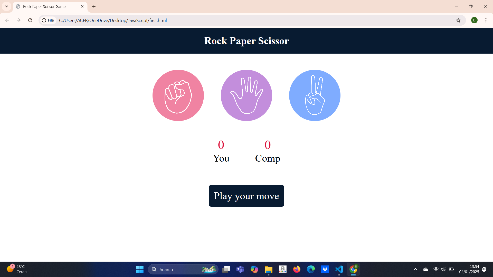
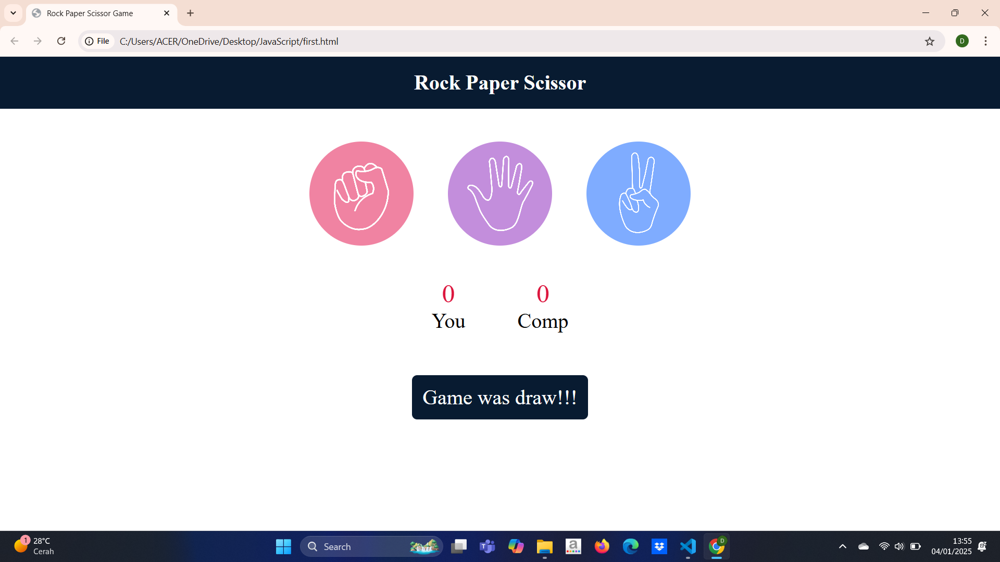
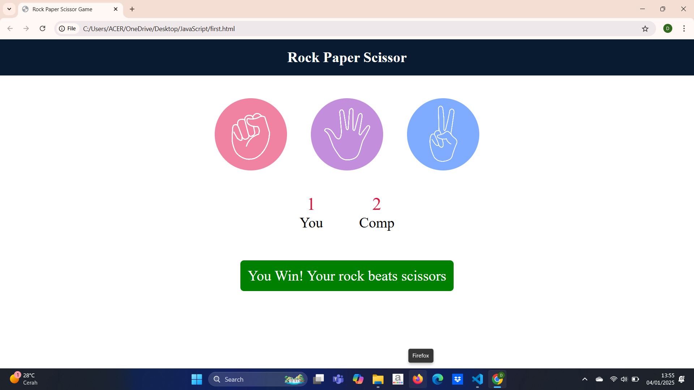

# Rock-Paper-Scissors
A simple web-based implementation of the classic Rock Paper Scissors game built using HTML, CSS, and JavaScript.

## Features
- User friendly interface with modern styling <br/>
- Random computer-generated choices <br/>
- Score tracking for both the player and the computer <br/>

## Installation
To run this project locally:<br/>
- Clone the repository:<br/>
```bash
 https://github.com/Drushti008/Rock-Paper-Scissors.git
 ```

## Screenshots
### Start screen

### Draw case

### Winner


### Contributing
Contributions are welcome! If you'd like to enhance the project.
